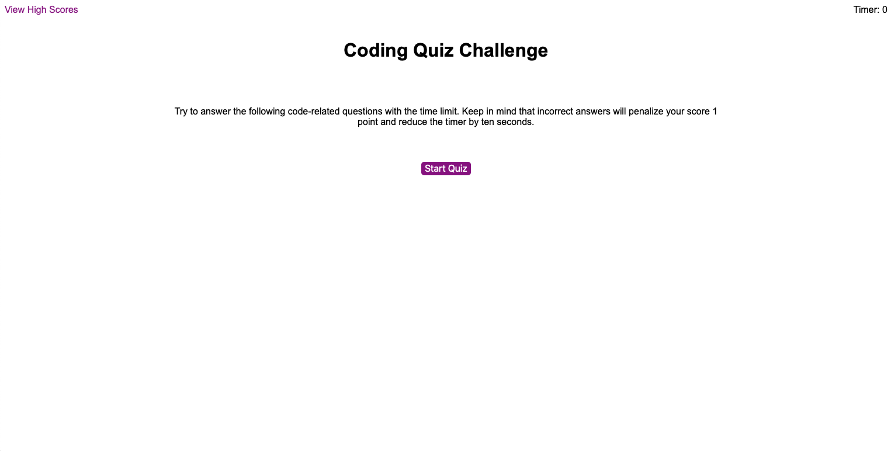

# Javascript Coding Quiz

## Description

This is a timed code quiz on basic Javascript with multiple-choice questions. This app will run in the browser and feature dynamically updated HTML and CSS powered by  JavaScript code. There are no html elements everything will be created in the Javascript code. It has a a clean and polished user interface and is responsive.

-------------

## Deployed App

Link to deployed app: [Code Quiz](https://crowandrew.github.io/code_quiz/)

-------------

## Visuals
 
 Screenshot of initial page



-------------

## Breakdown of JS files

The code for the quiz is broken up into two files the `script.js` that is the logic for the quiz and the `questions.js` that stores the questions. I identified that the data (questions) is irrelevant to the implementation of the quiz so I created that as a separate js file. I then created a logical data structure that would store these questions. Lastly, I didn't make any assumptions in my implementation on how that data exists, so I can easily reuse that code and make a server side call to get the data like this if I want to build a different quiz in the future.

-------------

## Deep dive into the JS Code used.

### Below I will break down the code for the `script.js` that handles most of the logic:

(Click on the triangle to see the code and a more detailed description of what is happening.)

<details>
<summary>Defining variables for initial setup</summary>
<p>In this section we are defining the global variables that we will later use in the build functions and sub functions.</p>

```javascript
const leftAside = document.createElement("aside");
const main = document.createElement("main");
const rightAside = document.createElement("aside");
const numberQuestions = quizQuestions.length;
let allHighScores = [];
let timerCount = 0;
let currentQuestion = 0;
let score = 0;
```
</details>

<details>
<summary>Calling the initial page</summary>
<p>This is simply just calling the init() function.</p>

```javascript
init()
```
</details>

<details>
<summary>Building the initial screen, rendering it to the screen and defining attributes</summary>
<p>This is setting the attributes for everything on the main page. Creating some html tags and entering the text for those tags. Then we are appending those to the document body so this displays on the window. We are resetting the score to zero as well. Lastly, we have an event listener waiting for a click that will clear all the html in the main section, set the timer to 60 seconds, then calling the startTimer() function and buildQuiz() function.</p>

```javascript
function init() {
  document.body.setAttribute("class", "container");
  leftAside.setAttribute("id", "highscore");
  leftAside.innerHTML = "View High Scores"
  rightAside.innerHTML = "Timer: <span></span>";
  rightAside.children[0].setAttribute("id", "timer");
  main.innerHTML = "<div><h1>Coding Quiz Challenge</h1></div><div><p>Try to answer the following code-related questions with the time limit. Keep in mind that incorrect answers will penalize your score 1 point and reduce the timer by ten seconds.</p></div><div><button>Start Quiz</button></div>";
  main.setAttribute("class", "");
  main.children[2].children[0].setAttribute("id", "startBtn")
  document.body.appendChild(leftAside);
  document.body.appendChild(main);
  document.body.appendChild(rightAside);
  document.getElementById('timer').textContent = timerCount;
  score = 0;
  document.getElementById("startBtn").addEventListener("click", function () {
    main.innerHTML = "";
    timerCount = 60;
    startTimer();
    buildQuiz();
  });
}
```
</details>

<details>
<summary>Building the quiz screen and rendering it onto the page</summary>
<p>This is building the framework for the quiz first by setting the inner HTML with a div with a header, a div with a un-ordered list and a div with an h2. We then set attributes and variables for these. Then we use a spread syntax expression so we can call variables from the getQuerySelectors()function below. Then using those variables we add some more buttons and set their ids to a,b,c and d. Lastly, we call the renderQuestions() function to load the questions onto the page.</p>

```javascript
function buildQuiz() {
  main.innerHTML = "<div><h1></h1></div><div><ul><li></li><li></li><li></li><li></li></ul></div><div><h2></h2></div>";
  main.setAttribute("class", "quiz");
  let quesArea = main.children[0].children[0];
  let ansArea = main.children[1].children[0];
  let fbArea = main.children[2].children[0];
  quesArea.setAttribute("id", "questionArea");
  ansArea.setAttribute("id", "answerArea");
  ansArea.children[0].setAttribute("id", "answerOne");
  ansArea.children[1].setAttribute("id", "answerTwo");
  ansArea.children[2].setAttribute("id", "answerThree");
  ansArea.children[3].setAttribute("id", "answerFour");
  fbArea.setAttribute("id", "feedbackArea");
  let qs = [...getQuerySelectors()];
  qs[1].innerHTML = "<button></button>";
  qs[2].innerHTML = "<button></button>";
  qs[3].innerHTML = "<button></button>";
  qs[4].innerHTML = "<button></button>";
  qs[1].children[0].setAttribute("id", "a");
  qs[2].children[0].setAttribute("id", "b");
  qs[3].children[0].setAttribute("id", "c");
  qs[4].children[0].setAttribute("id", "d");
  renderQuestions();
}
```
</details>

<details>
<summary>Building the final screen framework and rendering it onto the page</summary>
<p>This is building the framework for the final screen before entering your initials to the high score list. In this we are setting the timer to zero so it does not go to negative numbers. Displaying text that we are "All Done!" and then creating a form with attributes for the input fields. We then have an event listener waiting for a click on submit that will call the storeScore() that has the variable inputInitials passed into it and the highScore() function.</p>

```javascript
function gameOver() {
  timerCount = 0;
  document.getElementById('timer').textContent = timerCount;
  document.getElementById("questionArea").textContent = "All Done!";
  let finalMain = main.children[1];
  let h2 = document.createElement("h2");
  let scoreForm = document.createElement("form");
  let initials = document.createElement("label");
  let inputInitials = document.createElement("input");
  let submit = document.createElement("input")
  finalMain.innerHTML = "";
  h2.textContent = "Your final score is " + score;
  initials.textContent = "Enter Initials"
  scoreForm.setAttribute("id", "finalForm");
  initials.setAttribute("for", "userIN");
  inputInitials.setAttribute("type", "text");
  inputInitials.setAttribute("id", "userIN");
  inputInitials.setAttribute("name", "initials");
  submit.setAttribute("type", "submit");
  submit.setAttribute("value", "Submit");
  submit.setAttribute("id", "submitBtn");
  finalMain.appendChild(h2);
  finalMain.appendChild(scoreForm);
  scoreForm.appendChild(initials);
  scoreForm.appendChild(inputInitials);
  scoreForm.appendChild(submit);
  
  document.getElementById("submitBtn").addEventListener("click", function (event) {
    event.preventDefault();
    storeScore(inputInitials)
    highScore()
  });
  
}
```
</details>

<details>
<summary>Building the high score screen framework and rendering it onto the page</summary>
<p>This is building the framework for the high score screen and setting attributes. It is then calling the renderHighScore() function to load all the stored high scores. Lastly, we have two event listeners waiting to be clicked. The first event listener is looking at the go back button that will set the current questions to 0 and call the init() function to start the quiz again. The second event listener is looking ate the clear high scores button and will clear the allHighScores[] array and call the highScore() to reset the current screen.</p>

```javascript
function highScore() {
  main.innerHTML = "<div><h1>High Scores</h1></div><div></div><div></div>";
  let goBack = document.createElement("button");
  let clearHighScores = document.createElement("button");
  clearHighScores.textContent = "Clear High Scores";
  goBack.textContent = "Go Back";
  goBack.setAttribute("id", "goBack");
  main.setAttribute("class", "highScore");
  clearHighScores.setAttribute("id", "clearHighScores");
  main.children[2].appendChild(goBack);
  main.children[2].appendChild(clearHighScores)
  renderHighScores();
  
  document.getElementById("goBack").addEventListener("click", function () {
    currentQuestion = 0;
    init();
  });
  
  document.getElementById("clearHighScores").addEventListener("click", function () {
    allHighScores = [];
    highScore();
  });
  
}
```
</details>

<details>
<summary>Quiz timer function</summary>
<p>This function is creating timer for the quiz that will cycle every 1000 milliseconds. In that cycle it will reduce the time by 1 unless the timer is at zero. If the timer is at zero it will call the gameOver() function and break the cycle.</p>
```javascript
function startTimer() {
  let timeInterval = setInterval(function () {
    document.getElementById('timer').textContent = timerCount;
    timerCount--;
    if (timerCount <= 0) {
      document.getElementById('timer').textContent = timerCount;
      gameOver();
      clearInterval(timeInterval);
    }
  }, 1000);
}
```
</details>

<details>
<summary>Setting spread selectors with getQuerySelectors function</summary>
<p>This function is creating multiple variables so they can be used similar to global variables in multiple functions. The reason this is needed is that when the init() function is called at the start these ids do not yet exist to be defined as global variables.</p>

```javascript
function getQuerySelectors() {
  const question = document.getElementById("questionArea");
  const answers = document.getElementById("answerArea")
  const answerOne = document.getElementById("answerOne");
  const answerTwo = document.getElementById("answerTwo");
  const answerThree = document.getElementById("answerThree");
  const answerFour = document.getElementById("answerFour");
  return [question, answerOne, answerTwo, answerThree, answerFour, answers]
};
```
</details>

<details>
<summary>Rendering the current question</summary>
<p>This function is setting the text content areas defined in the getQuerySelectors() and giving them the value of the properties from the object pulled from the quizQuestions array. We are using the index and the currentQuestion to set what question we are on. Lastly, it runs the nextQuestion() function.</p>

```javascript
function renderQuestions() {
  let qs = [...getQuerySelectors()];
  qs[0].textContent = quizQuestions[currentQuestion].question;
  qs[1].children[0].textContent = quizQuestions[currentQuestion].answers.a;
  qs[2].children[0].textContent = quizQuestions[currentQuestion].answers.b;
  qs[3].children[0].textContent = quizQuestions[currentQuestion].answers.c;
  qs[4].children[0].textContent = quizQuestions[currentQuestion].answers.d;
  nextQuestion();
}
```
</details>

<details>
<summary>Checking if the answer is correct and adding to score if right or reducing score and time if wrong. Then it loads next question.</summary>
<p>This section handles a lot. First it pulls the variables form getQuerySelectors() function. Then is attaches an event listen to the entire answers section, Once an answer is clicked it is pulling the id for that button and seeing if it matches the correct answer for that question. If it does match it will increase the score by one and set answerCorrectly variable to true. If it does not match it reduces the score bye 1, subtracts 10 seconds from the timer and sets answerCorrectly to false. Next, it adds 1 ot currentQuestion to get the next question. It then checks to make sure that we are not out of questions before then calls buildQuiz(). If we are out of questions it calls gameOver(). Lastly, it displays Correct if answerCorreclty is true for 1.5 seconds or Wrong is answerCorrectly is false for 1.5 seconds.</p>

```javascript
function nextQuestion() {
  let qs = [...getQuerySelectors()];
  qs[5].addEventListener("click", function (event) {
    event.preventDefault();
    if (event.target.matches("button")) {
      console.log(event.target.textContent);
      let userAnswer = event.target.id;
      let correctAnswer = quizQuestions[currentQuestion].correctAnswer;
      let answerCorrectly;
      if (userAnswer === correctAnswer) {
        score++
        answerCorrectly = true;
      } else {
        score--
        timerCount -= 10;
        document.getElementById('timer').textContent = timerCount;
        answerCorrectly = false;
      };
      currentQuestion++
      if (currentQuestion !== numberQuestions) {
        buildQuiz(currentQuestion);
      } else {
        gameOver();
      };
      if (answerCorrectly) {
        document.getElementById("feedbackArea").textContent = "Correct!"
        setTimeout(function () {
          document.getElementById("feedbackArea").textContent = "";
        }, 1500);
      } else {
        document.getElementById("feedbackArea").textContent = "Wrong!"
        setTimeout(function () {
          document.getElementById("feedbackArea").textContent = "";
        }, 1500);
      };
    };
  });
}
```
</details> 

<details>
<summary>This stores the high scores from gameOver</summary> 
<p>This is grabbing the score and appending the initials to it as long as some has entered something in the initials field. Then it is creating the variable newHighScore and pushing it to the array allHighScores.</p>

```javascript
function storeScore(inputInitials) {
  let initialText = inputInitials.value.trim();
  if (initialText === "") {
    return
  }
  let newHighScore = score + "   " + initialText;
  allHighScores.push(newHighScore);
}
```
</details>

<details>
<summary>Render High Scores</summary>
<p>This is creating a order list element on high scores screen and then sorting the array allHighScores for highest to lowest. Next, it is looping through the sorted array allHighScores and creating a list item for each.</p>

```javascript
function renderHighScores(){
  let highScoreList = document.createElement("ol");
  main.children[1].appendChild(highScoreList);
  let allHighScoresSort = allHighScores.sort();
  for (let i = 0; i < allHighScores.length; i++) {
    let highScore = allHighScoresSort[i];
    let li = document.createElement("li");
    li.textContent = highScore;
    li.setAttribute("data-index", i);
    
    highScoreList.appendChild(li);
    
  }
}
```
</details>

<details>
<summary>Event listener for HighScore button in upper left on all pages,</summary>
<p>This is the event listener that sits on every p[age waiting for someone to click View High Scores. When clicked it clears the HTML for main and the calls the highScore() function.</p>
```javascript
leftAside.addEventListener("click", function () {
  main.innerHTML = "";
  highScore();
})
```
</details>

-------------

## Author

Andrew Crow

-------------

## License

MIT License

Copyright (c) 2020 Andrew Crow

Permission is hereby granted, free of charge, to any person obtaining a copy
of this software and associated documentation files (the "Software"), to deal
in the Software without restriction, including without limitation the rights
to use, copy, modify, merge, publish, distribute, sublicense, and/or sell
copies of the Software, and to permit persons to whom the Software is
furnished to do so, subject to the following conditions:

The above copyright notice and this permission notice shall be included in all
copies or substantial portions of the Software.

THE SOFTWARE IS PROVIDED "AS IS", WITHOUT WARRANTY OF ANY KIND, EXPRESS OR
IMPLIED, INCLUDING BUT NOT LIMITED TO THE WARRANTIES OF MERCHANTABILITY,
FITNESS FOR A PARTICULAR PURPOSE AND NONINFRINGEMENT. IN NO EVENT SHALL THE
AUTHORS OR COPYRIGHT HOLDERS BE LIABLE FOR ANY CLAIM, DAMAGES OR OTHER
LIABILITY, WHETHER IN AN ACTION OF CONTRACT, TORT OR OTHERWISE, ARISING FROM,
OUT OF OR IN CONNECTION WITH THE SOFTWARE OR THE USE OR OTHER DEALINGS IN THE
SOFTWARE.